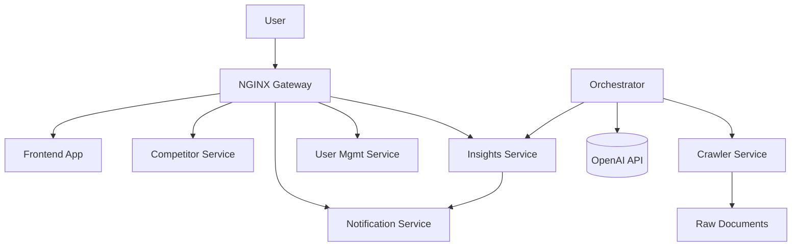

# System Architecture

## High-Level Design

The Connected Insights platform follows a microservices architecture pattern, communicating via REST APIs and sharing a common network.

### Components

1. **Frontend (Angular)**
   - Single Page Application (SPA).
   - Interacts with backend services via NGINX Reverse Proxy.

2. **API Gateway (NGINX)**
   - Routes `/api/competitors` -> Competitor Service
   - Routes `/api/insights` -> Insights Service
   - Routes `/api/notifications` -> Notification Service
   - Routes `/api/auth` -> User Management Service

3. **Microservices (FastAPI)**
   - **Competitor Service**: Stores company profiles and trial data.
   - **Insights Service**: Stores generated insights.
   - **Notification Service**: Manages subscriptions and delivery history.
   - **Crawler Service**: Scheduled tasks to fetch external data.
   - **Orchestrator**: Central intelligence hub. Polls raw documents, calls OpenAI for classification/enrichment, creates insights, and triggers notifications.
   - **User Management Service**: Handles user authentication (JWT) and profile management.

   - **PostgreSQL**: Primary transactional store for all services (separate schemas/tables).
   - **MongoDB**: Used by Graylog for log metadata.
   - **OpenSearch**: Used by Graylog for log indexing.

### Security
1. **Authentication**:
   - `User Management Service` issues JWTs.
   - `Orchestrator` generates internal `System Token` (Admin Role) for service-to-service communication.
2. **Authorization**:
   - Services validate JWTs and enforce roles (`ADMIN`, `ANALYST`, `EXECUTIVE`).
3. **Error Handling**:
   - Global Exception Handler ensures standardized JSON error responses across all services.

### Data Flow

1. **Ingestion**: Crawler fetches data -> Stores raw document.
2. **Processing**: Orchestrator polls for new documents.
3. **Enrichment**: Orchestrator calls OpenAI -> Extracts JSON data (Entity Extraction, Relevance Scoring).
4. **Storage**: Enriched data saved to Insights Service via API.
5. **Notification**: Orchestrator triggers Notification Service if insight matches subscriptions.

### Diagram
*(See generated diagram in repository or documentation tool)*

