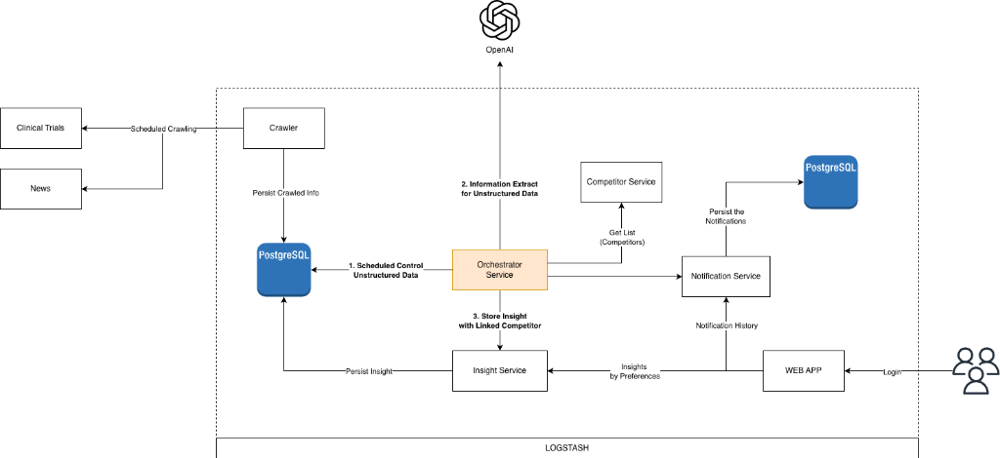

# Connected Insights

A microservice-based application for tracking competitor clinical trials and insights in the pharmaceutical industry.

## Quick Start

1.  **Start Services**:
    ```bash
    docker compose up -d --build
    ```
2.  **Access App**:
    -   Frontend: [http://localhost](http://localhost)
    -   Graylog (Logs): [http://localhost:9000](http://localhost:9000) (admin / admin)

## Monitoring & Logs (Graylog)

1.  **Login**: Access [http://localhost:9000](http://localhost:9000) using `admin` / `admin`.
2.  **Setup Input**:
    -   Go to **System** -> **Inputs**.
    -   Select **Syslog UDP** from the dropdown and click **Launch new input**.
    -   **Title**: `Docker Logs`
    -   **Port**: `1514`
    -   **Bind address**: `0.0.0.0`
    -   Click **Save**.
3.  **View Logs**: Go to **Search** to see real-time logs from all services.

## Architecture Overview
The system consists of several microservices orchestrated via Docker Compose:

- **Competitor Service**: Manages competitor data and clinical trials (PostgreSQL).
- **Insights Service**: Manages insights and relevance scoring (PostgreSQL).
- **Notification Service**: Handles user subscriptions and notifications (PostgreSQL).
- **Crawler Service**: Fetches data from external sources (ClinicalTrials.gov, News).
- **Orchestrator**: Intelligence hub that pulls raw data, uses OpenAI to classify/score insights, and triggers notifications.
- **User Management Service**: Handles authentication and user roles.
- **Frontend**: Angular application serving the dashboard.
- **API Gateway**: NGINX routing requests to services.



See [ARCHITECTURE.md](ARCHITECTURE.md) for detailed design.

## Prerequisites
- Docker & Docker Compose
- Python 3.11+ (for local dev)
- Node.js 18+ (for frontend dev)
- OpenAI API Key

## Setup & Run

1. **Clone the repository**
2. **Configure Environment**
   - Create `.env` file in root (see `.env.example` if available, or just set `OPENAI_API_KEY`).
   - `export OPENAI_API_KEY=sk-...`

3. **Start Services**
   ```bash
   docker compose up --build
   ```

4. **Access the Application**
   - Dashboard: [http://localhost](http://localhost)
   - Graylog (Logs): [http://localhost:9000](http://localhost:9000) (admin/admin)

## Seeding Data (Optional)
To populate the database with dummy competitors, users, and crawl jobs:
1. Ensure all services are running (`docker compose up`).
2. Run the seed script:
   ```bash
   python3 scripts/seed_data.py
   ```
   **Note**: This script uses the default `admin@astrazeneca.com` / `password123` credentials to authenticate.

## Testing
Run unit tests for core services:
```bash
docker compose exec competitor-service python -m pytest
docker compose exec insights-service python -m pytest
docker compose exec notification-service python -m pytest
```


## API Documentation
See [API.md](API.md) for full endpoint details.
